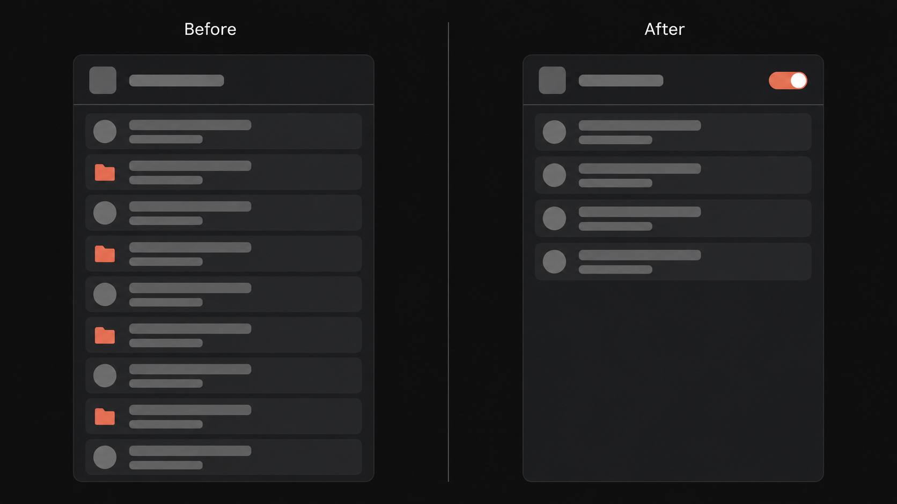

# Claude Cloak

Claude Cloak is a small Chrome extension (Manifest V3) that hides Project chats
from the Claude sidebar, controlled by a single toggle in the toolbar popup. It
keeps the sidebar focused on your standalone chats. Starred chats always stay
visible.

It collects no data and makes no network requests beyond Claude's own
same-origin API. There is no tracking, no analytics, and no remote code.

<p align="center">
  <video
    src="assets/images/demo.mp4"
    controls
    muted
    playsinline
    width="640"
  >
    Your browser does not show embedded video.
    <a href="assets/images/demo.mp4">Watch the demo</a>.
  </video>
</p>

## What it does

- Detects which chats belong to a Project using the `project_uuid` field from
  Claude's own API, not by guessing from chat titles.
- Hides those chats from the sidebar when the toggle is on, and restores them
  when it is off.
- Keeps starred chats visible at all times.
- Shows a live count of how many chats are currently hidden in the popup.
- Remembers your toggle choice across browser restarts and synced devices,
  defaulting to on.

## Install (unpacked)

1. Clone or download this repository.
2. Open `chrome://extensions` in Chrome.
3. Turn on Developer mode (top right).
4. Click "Load unpacked" and select the repository folder (the one containing
   `manifest.json`).
5. Open `https://claude.ai`, sign in, and click the Claude Cloak icon to toggle
   hiding.

No build step is required to run the extension. The Poppins font files and the
icons are committed under `assets/`.

## Usage

- Click the toolbar icon to open the popup.
- Use the "Hide project chats" switch to turn hiding on or off.
- A status line with a small indicator shows how many project chats are
  currently hidden in the active Claude tab.
- If a hidden chat ever reappears (for example after a long session), reload the
  Claude tab. The popup hint says the same thing.

## How it works

Claude is a single-page app, and its sidebar is rebuilt constantly as you
navigate and scroll. The extension is split into two scripts that run in two
different JavaScript worlds, because each world can do something the other
cannot.

- `src/injected.js` runs in the page's own world (`"world": "MAIN"`). Only a
  main-world script can wrap the page's real `fetch` and `XMLHttpRequest`, so
  this is where we watch responses from `/chat_conversations` and read each
  record's `project_uuid`. It also hooks `history.pushState`,
  `history.replaceState`, and `popstate` to notice client-side navigation. It
  touches no `chrome.*` APIs and posts only two message shapes back to the page
  with `window.postMessage`.
- `src/content.js` runs in the isolated content-script world, where `chrome.*`
  APIs and stable DOM access are available. It owns the set of project chat
  UUIDs, seeds that set with a direct paginated fetch on load (so chats already
  present before injection are covered), listens for the main-world messages,
  and hides matching rows.

Hiding is done with one injected stylesheet rule, gated on a class on the
`<html>` element:

```css
html.claude-cloak-on [data-claude-cloak="hidden"] { display: none !important; }
```

The content script marks project rows with `data-claude-cloak="hidden"` and
toggles the root class from a cached flag. The marking is scoped to the sidebar
only, so the chat list shown on a Project's own page stays fully visible. The
goal is only to tidy the sidebar. Because the rule is already present,
toggling is instant and there is no flash of project chats appearing before
they are hidden. The `MutationObserver` on the sidebar is debounced, the enabled
flag is cached in memory and updated through `chrome.storage.onChanged`, and the
observer re-attaches itself if Claude replaces the sidebar node.

### API details

- Organization id: read from the URL when present, otherwise from
  `GET /api/organizations` (using `orgs[0].uuid`). These are same-origin
  requests that carry your existing Claude cookies.
- Chats: paged from
  `GET /api/organizations/{orgId}/chat_conversations?limit=100&offset={n}&starred=false`,
  looping until a short page is returned, capped at 1000 records to avoid
  runaway requests. The `starred=false` filter is why starred chats are never
  collected and therefore never hidden.
- A chat belongs to a project when its `project_uuid` is truthy.
- New or just-opened chats: the list endpoint returns an array, but creating a
  chat (POST) or opening one (GET `.../chat_conversations/{uuid}`) returns a
  single conversation object. The interceptor handles both shapes, so a chat
  created inside a project is hidden right away instead of waiting for a reload.
  As a safety net, navigating to a chat also verifies that one conversation
  directly (once per chat) in case the create or open response is ever missed.

If Claude changes an endpoint, a parameter, or the sidebar markup, prefer
updating the small set of constants and selectors at the top of `content.js`
and `injected.js` rather than working around the change elsewhere. Any such
correction should be noted here.

## Permissions and privacy

- `storage`: to remember the toggle state and mirror the hidden count for the
  popup.
- Host permission `https://claude.ai/*`: to run the scripts on Claude and make
  the same-origin API calls described above.

That is the full list. No data leaves your browser. No third-party servers are
contacted. The font is bundled locally rather than loaded from Google Fonts, so
even the popup makes no outbound request.

## Verifying it works

With the toggle on, project chats (the rows with a folder icon) drop out of the
sidebar, leaving your standalone chats:

<p align="center">
  
</p>

A full end-to-end test of the hiding behavior needs an authenticated Claude
session, which cannot run unattended. Verify it by hand:

1. Load the unpacked extension and open `https://claude.ai` while signed in.
2. Make sure you have at least one Project with chats in it, and at least one
   standalone chat, in the sidebar.
3. With the toggle on, confirm the Project chats disappear from the sidebar and
   the standalone and starred chats remain.
4. Scroll the sidebar to load older chats (past the first 100) and confirm
   Project chats among them are also hidden.
5. Create a new chat inside a Project, or open one, and confirm it is hidden
   without a full page reload.
6. Open the popup and confirm the count matches the number of hidden chats.
7. Turn the toggle off and confirm every Project chat reappears immediately.
8. Turn it back on, then restart the browser and confirm the toggle is still on.

## Project layout

```
manifest.json        extension manifest (MV3)
src/
  injected.js        main-world script: intercepts fetch/XHR and history
  content.js         isolated-world script: owns UUIDs, hiding, observer
  popup.html         popup markup
  popup.css          popup styles (self-hosted Poppins, coral accent, dark theme)
  popup.js           popup logic (toggle, live count)
assets/
  fonts/             self-hosted Poppins woff2 files (400, 500, 600)
  icons/             icon-16.png, icon-48.png, icon-128.png
```

## License

MIT. See `LICENSE`.
